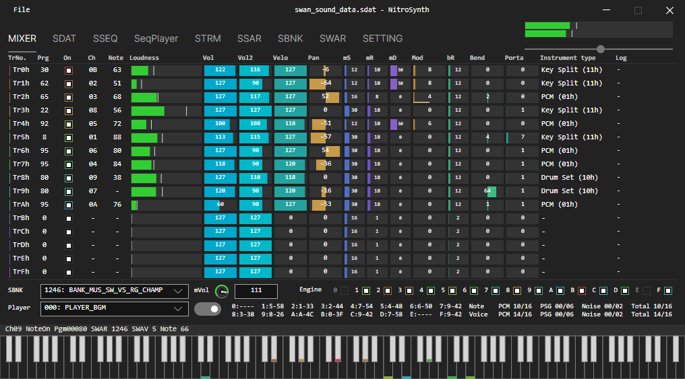
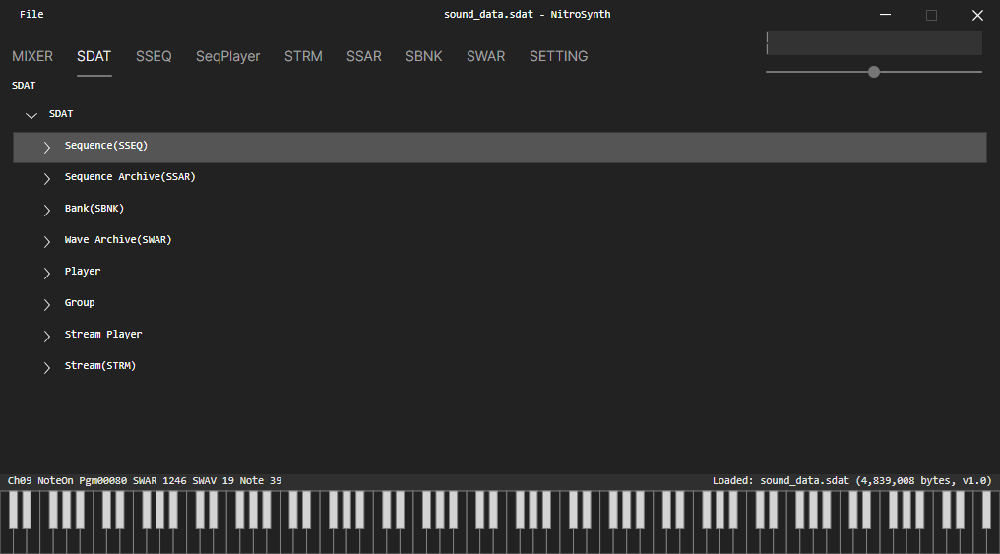
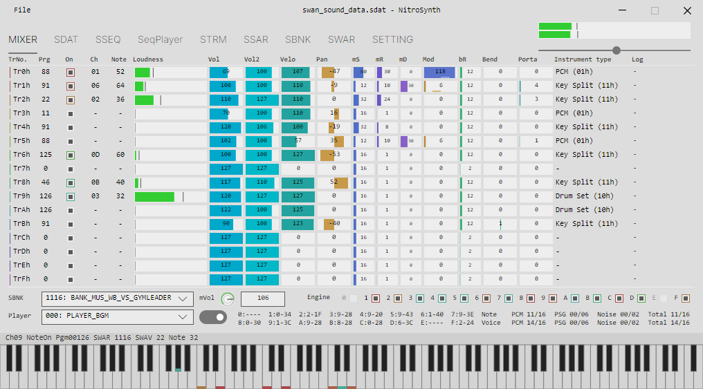
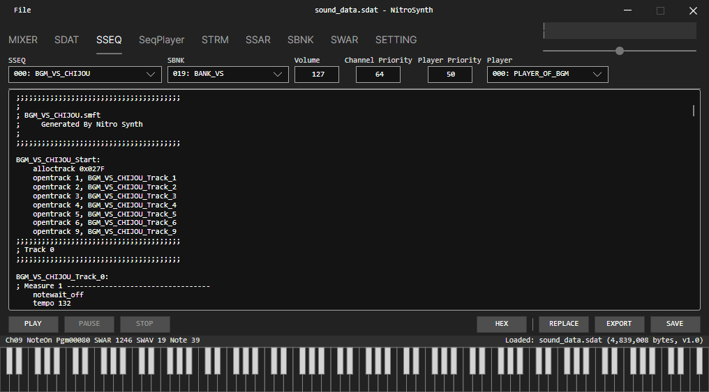
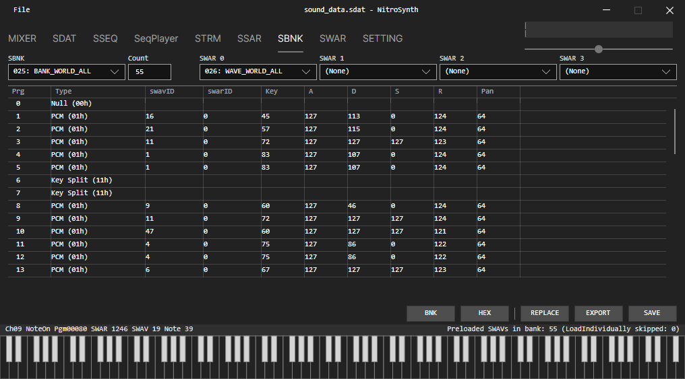
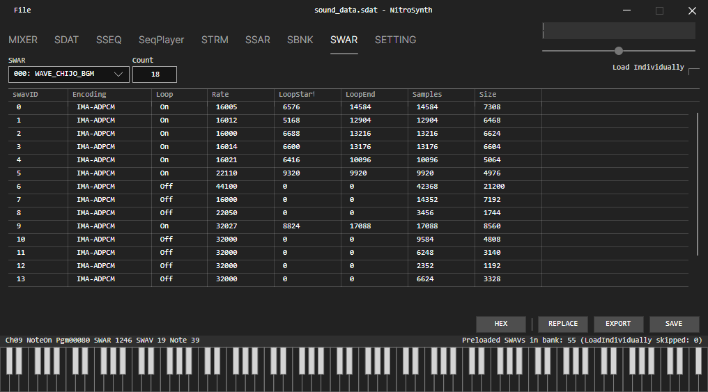
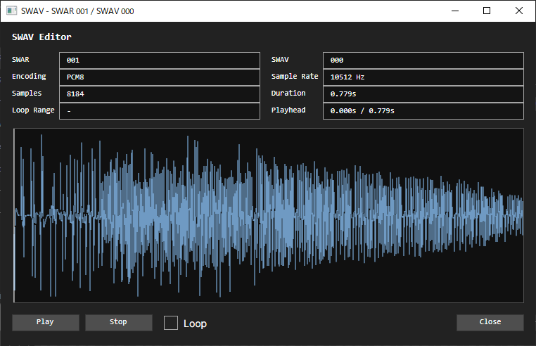
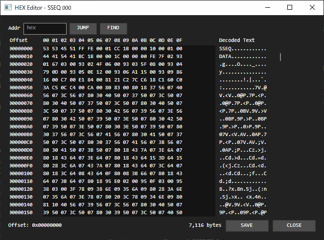
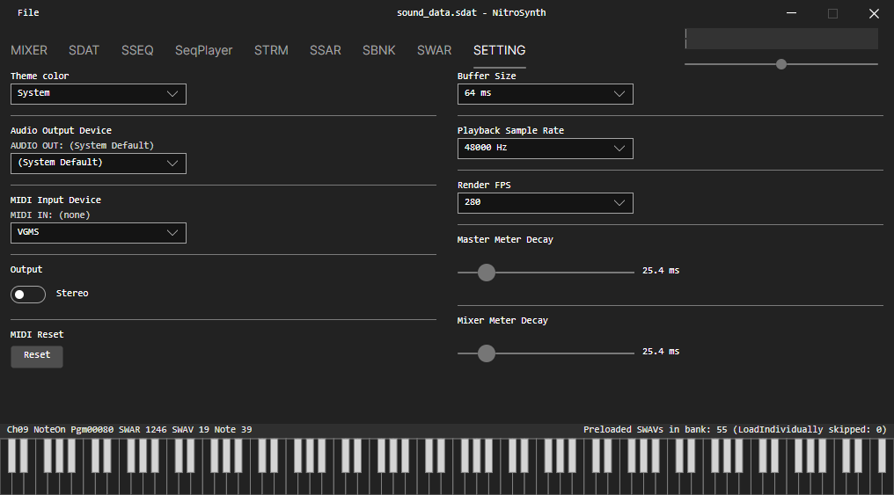

# NitroSynth

NitroSynth is a desktop sound-asset workstation for **NDS** Nitro audio data.
It is designed for practical `.sdat` analysis, playback, editing, and export workflows with a real-time mixer-centric UI.



## Overview

NitroSynth loads SDAT archives, parses core blocks (`SYMB`, `INFO`, `FAT`, `FILE`), and exposes each asset family in dedicated tabs.
You can inspect structure, audition sequence data through the internal synth engine, edit content in-memory, and export working formats.

Main goals:

- fast SDAT inspection and iteration
- NDS-style playback behavior for sequence/audio workflows
- safe editing flow without destructive overwrite of source files

## UI Walkthrough

### SDAT File Tree

The SDAT tab provides a hierarchical file tree for quick navigation across sequence, bank, wave archive, and stream entries.
Double-clicking entries jumps to the related editor/view tab.



### MIXER (Dark/Light + Motion)

The mixer is the center of realtime monitoring and control:

- 16 channel strips with output/mute controls
- realtime level and peak indicators
- voice usage and channel activity tracing
- master L/R metering and master volume control

<p align="center">
  
  
</p>

<p align="center">
  
</p>

### SSEQ View and Editing

The SSEQ tab supports sequence browsing, metadata inspection, realtime play/pause/stop, and SMFT-oriented text editing/compile-back flow.
Export targets include `.sseq`, `.smft`, and `.mid`.



### SBNK Editing

The SBNK tab provides instrument-focused editing, including parameter-level updates and access to related articulation/editor views.



### SWAR Browsing

The SWAR tab displays wave archive contents and key metadata (encoding, loop, rate, sample/size information).



### SWAV Editor

SWAV entries can be opened in a dedicated editor for waveform-level inspection and editing tasks.



### HEX Editor

HEX editor sessions are available for multiple asset types, with find/copy/paste workflows and in-memory save/apply behavior.



### Settings

The settings tab controls theme, audio output, MIDI input, output mode, buffer size, playback sample rate, render FPS, and meter decay behavior.



## Core Features

### SDAT Navigation and Metadata

- open `.sdat` from the File menu
- inspect SDAT size/version and block layout
- browse entries via SDAT tree and jump to target tabs

### Sequence Workflow (SSEQ / SSAR)

- realtime sequence playback controls
- decompile and text-edit sequence data
- compile-back with instruction-length safety
- export as `.sseq`, `.smft`, `.mid`
- per-sequence extraction/export from SSAR

### Bank and Wave Workflow (SBNK / SWAR / SWAV)

- instrument listing and parameter editing
- support for single/drumset/keysplit structures
- wave archive inspection with per-entry metadata
- dedicated SWAV editor access

### Realtime Audio Monitoring

- 16-strip mixer view with activity feedback
- master stereo metering with peak/clip states
- PCM/PSG/Noise voice usage counters
- channel gating and output masking controls

### HEX and Text Editing Sessions

- in-app HEX sessions for major asset categories
- MUS/BNK text-oriented editor sessions
- immediate in-memory reflection to active views

## Audio and MIDI

NitroSynth includes an internal synth/mixer engine tuned for NDS-style behavior:

- PCM, PSG, and Noise voice paths
- channel controller handling (volume/expression/pan/mod/pitch bend/portamento)
- channel and track masking in mix/output stages

MIDI Input:

- device enumeration from system MIDI devices
- auto-connect on selection
- note/control/pitch routing to engine and UI

Audio Output:

- output device selection
- mono/stereo toggle
- buffer size presets (default `48 ms`)
- playback sample rate options including `32768 Hz` (native NDS rate)

## Settings Reference

Current configurable items include:

- Theme: `System`, `Light`, `Dark`
- Audio Output Device
- MIDI Input Device
- Output mode: `Stereo` / `Mono`
- Buffer Size
- Playback Sample Rate
- Render FPS: `24, 30, 60, 120, 144, 240, 280, 320, 360, 400, 480, 510, 540, 610, Unlimited`
- Master Meter Decay: `0-200 ms` (default `100 ms`)
- Mixer Meter Decay: `0-200 ms` (default `100 ms`)

## Editing Model

NitroSynth uses an in-memory override model for active editing sessions.
This keeps source data safer during iterative work.

In practice:

- editor saves are reflected to the running app state
- exports use current edited state where applicable
- full write-back pipelines are still evolving

## Current Limitations

Some actions are intentionally partial/not yet implemented in specific contexts (for example some `REPLACE`, `SAVE`, or tree-context operations).

## Tech Stack

- .NET 8
- Avalonia UI
- NAudio

## Getting Started

### Prerequisites

- .NET SDK 8.0+

### Build

```bash
dotnet build
```

### Run

```bash
dotnet run --project src/NitroSynth.App
```

### Test

```bash
dotnet test tests/NitroSynth.Tests/NitroSynth.Tests.csproj
```

## Repository Layout

- `src/NitroSynth.App` - desktop application
- `src/NitroSynth.App/NDS` - NDS format parsing/decompile logic
- `src/NitroSynth.App/Audio` - synth/mixer engine
- `tests/NitroSynth.Tests` - unit tests
